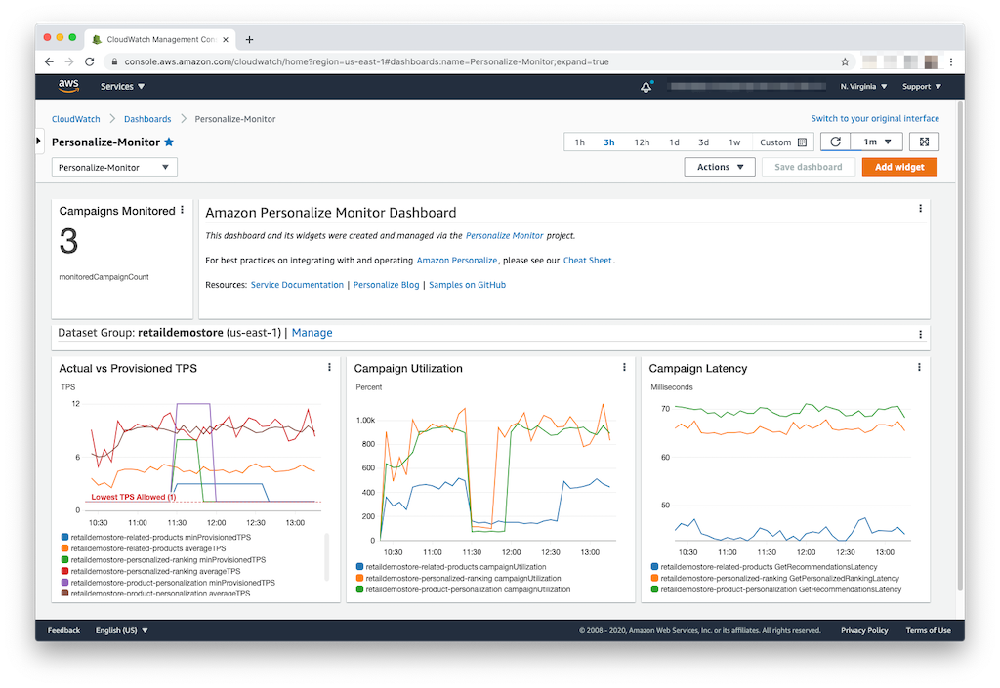
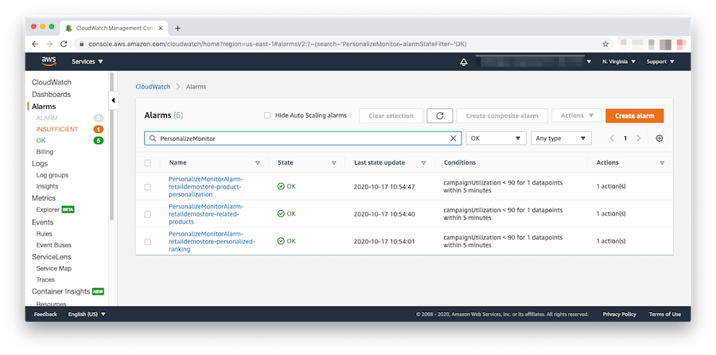
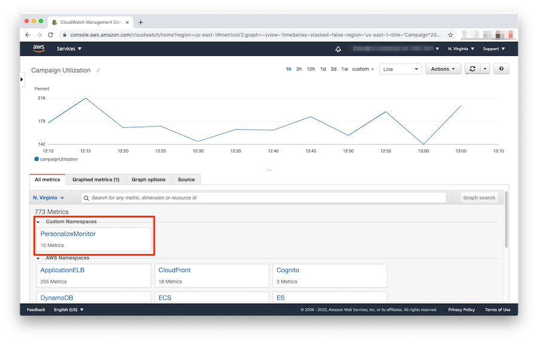
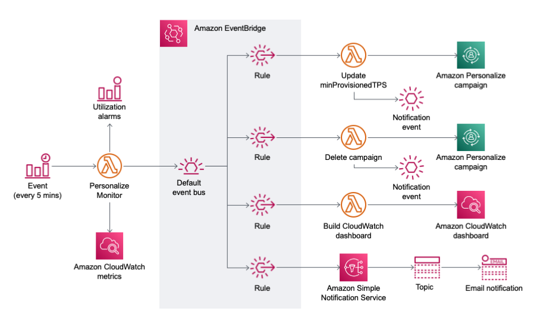

# Amazon Personalize Monitoring

<!-- vscode-markdown-toc -->
* [Why is this important?](#Whyisthisimportant)
* [Features](#Features)
	* [CloudWatch dashboard](#CloudWatchdashboard)
	* [CloudWatch alarms](#CloudWatchalarms)
	* [CloudWatch metrics](#CloudWatchmetrics)
	* [Cost optimization (optional)](#Costoptimizationoptional)
		* [Idle campaigns](#Idlecampaigns)
		* [Over-provisioned campaigns](#Over-provisionedcampaigns)
* [Architecture](#Architecture)
* [Installing the application](#Installingtheapplication)
* [Uninstalling the application](#Uninstallingtheapplication)
* [FAQs](#FAQs)
* [Reporting issues](#Reportingissues)
* [License summary](#Licensesummary)

<!-- vscode-markdown-toc-config
	numbering=false
	autoSave=true
	/vscode-markdown-toc-config -->
<!-- /vscode-markdown-toc -->

This project contains the source code and supporting files for deploying a serverless application that adds monitoring, alerting, and optimzation capabilities for [Amazon Personalize](https://aws.amazon.com/personalize/), an AI service from AWS that allows you to create custom ML recommenders based on your data. Highlights include:

- Generation of additional [CloudWatch metrics](https://docs.aws.amazon.com/AmazonCloudWatch/latest/monitoring/working_with_metrics.html) to track the Average TPS, `minProvisionedTPS`, and Utilization of Personalize [campaigns](https://docs.aws.amazon.com/personalize/latest/dg/campaigns.html) over time.
- [CloudWatch alarms](https://docs.aws.amazon.com/AmazonCloudWatch/latest/monitoring/AlarmThatSendsEmail.html) to alert you via SNS/email when campaign utilization drops below a configurable threshold or has been idle for a configurable length of time (optional).
- [CloudWatch dashboard](https://docs.aws.amazon.com/AmazonCloudWatch/latest/monitoring/CloudWatch_Dashboards.html) populated with graph widgets for Actual vs Provisioned TPS, Campaign Utilization, Campaign Latency, and the number of campaigns being monitored.
- Capable of monitoring campaigns across multiple regions in the same AWS account.
- Automatically delete campaigns that have been idle more than a configurable number of hours (optional).
- Automatically reduce the `minProvisionedTPS` for over-provisioned campaigns to optimize cost (optional).

## <a name='Whyisthisimportant'></a>Why is this important?

Once you create a solution and solution version based on your data, an Amazon Personalize campaign can be created that allows you to retrieve recommendations in real-time based on the solution version. This is typically how Personalize is integrated into your applications. When an application needs to display personalized recommendations to a user, a [GetRecommendations](https://docs.aws.amazon.com/personalize/latest/dg/getting-real-time-recommendations.html#recommendations) or [GetPersonalizedRanking](https://docs.aws.amazon.com/personalize/latest/dg/getting-real-time-recommendations.html#rankings) API call is made to a campaign to retrieve recommendations. Just like monitoring your own application components is important, monitoring your Personalize campaigns is also important and considered a best practice. This application is designed to help you do just that.

When you provision a campaign using the [CreateCampaign](https://docs.aws.amazon.com/personalize/latest/dg/API_CreateCampaign.html) API, you must specify a value for `minProvisionedTPS`. This value specifies the requested _minimum_ provisioned transactions (calls) per second that Amazon Personalize will support for that campaign. As your actual request volume to a campaign approaches its `minProvisionedTPS`, Personalize will automatically provision additional resources to meet your request volume. Then when request volume drops, Personalize will automatically scale back down **no lower** than `minProvisionedTPS`. **Since you are billed based on the higher of actual TPS and `minProvisionedTPS`, it is therefore important to not over-provision your campaigns to optimize cost.** This also means that leaving a campaign idle (active but no longer in-use) will result in unnecessary charges. This application gives you the tools to visualize your campaign utilization, to be notified when there is an opportunity to tune your campaign provisioning, and even take action to reduce and eliminate over-provisioning.

> General best practice is to set `minProvisionedTPS` to `1`, or your low watermark for campaign recommendations requests, and let Personalize auto-scale campaign resources to meet actual demand.

See the Amazon Personalize [pricing page](https://aws.amazon.com/personalize/pricing/) for full details on costs.

## <a name='Features'></a>Features

### <a name='CloudWatchdashboard'></a>CloudWatch dashboard

When you deploy this application, a [CloudWatch dashboard](https://docs.aws.amazon.com/AmazonCloudWatch/latest/monitoring/CloudWatch_Dashboards.html) is built with widgets for Actual vs Provisioned TPS, Campaign Utilization, and Campaign Latency for the campaigns you wish to monitor. The dashboard gives you critical visual information to assess how your campaigns are performing and being utilized. The data in these graphs can help you properly tune your campaign's `minProvisionedTPS`.



For more details on the CloudWatch dashboard created and maintained by this application, see the [dashboard_mgmt](./src/dashboard_mgmt_function/) function page.

### <a name='CloudWatchalarms'></a>CloudWatch alarms

At deployment time, you can optionally have this application automatically create [CloudWatch alarms](https://docs.aws.amazon.com/AmazonCloudWatch/latest/monitoring/AlarmThatSendsEmail.html) that will alert you when a monitored campaign's utilization drops below a threshold you define for nine out of twelve evaluation periods. Since the intervals are 5 minutes, that means that nine of the 5 minute evaluations over a 1 hour span must be below the threshold to enter an alarm status. The same rule applies to transition from alarm to OK status. Similarly, the idle campaign alarm will alert you when there has been no request activity for a campaign for a configurable amount of time. The alarms will be setup to alert you via email through an SNS topic. Once the alarms are setup, you can alternatively link them to any operations and messaging tools you already use (i.e. Slack, PagerDuty, etc).



For more details on the CloudWatch alarms created by this application, see the [personalize_monitor](./src/personalize_monitor_function/) function page.

### <a name='CloudWatchmetrics'></a>CloudWatch metrics

To support the CloudWatch dashboard and alarms described above, a few new custom [CloudWatch metrics](https://docs.aws.amazon.com/AmazonCloudWatch/latest/monitoring/working_with_metrics.html) are added for the monitored campaigns. These metrics are populated by the [personalize_monitor](./src/personalize_monitor_function/) Lambda function that is setup to run every 5 minutes in your account. You can find these metrics in CloudWatch under Metrics in the "PersonalizeMonitor" namespace.



For more details on the custom metrics created by this application, see the [personalize_monitor](./src/personalize_monitor_function/) function page.

### <a name='Costoptimizationoptional'></a>Cost optimization (optional)

This application can be optionally configured to automatically perform cost optimization actions for your Amazon Personalize campaigns.

#### <a name='Idlecampaigns'></a>Idle campaigns
Idle campaigns are those that have been provisioned but are not receiving any `GetRecommendations`/`GetPersonalizedRanking` calls. Since costs are incurred while a campaign is active regardless of whether it receives any requests, detecting and eliminating these idle campaigns can be an important cost optimization activity. This can be particularly useful in non-production AWS accounts such as development and testing where you are more likely to have abandoned campaigns. See the `AutoDeleteIdleCampaigns` and `IdleCampaignThresholdHours` deployment parameters in the installation instructions below and the [personalize_monitor](./src/personalize_monitor_function#automatically-deleting-idle-campaigns-optional) function for details.

#### <a name='Over-provisionedcampaigns'></a>Over-provisioned campaigns

Properly provisioning campaigns, as described earlier, is also an important cost optimization activity. This application can be configured to automatically reduce a campaign's `minProvisionedTPS` based on actual request volume. This will optimize a campaign's utilization when request volume is lower while relying on Personalize to auto-scale based on actual activity. See the `AutoAdjustCampaignMinProvisionedTPS` deployment parameter below and the [personalize_monitor](./src/personalize_monitor_function#automatically-adjusting-campaign-minprovisionedtps-optional) function for details.

## <a name='Architecture'></a>Architecture

The following diagram depicts how the Lambda functions in this application work together using an event-driven approach built on [Amazon EventBridge](https://docs.aws.amazon.com/eventbridge/latest/userguide/what-is-amazon-eventbridge.html). The [personalize_monitor](./src/personalize_monitor_function/) function is invoked every five minutes to generate CloudWatch metric data based on the monitored campaigns and create alarms (if configured). It also generates events which are published to EventBridge that trigger activities such as optimizing a campaign's `minProvisionedTPS`, deleting idle campaigns, updating the Personalize Monitor CloudWatch dashboard, and sending notifications. This approach allows you to more easily integrate these functions into your own operations by sending your own events, say, to trigger the dashboard to be rebuilt after you create a campaign or register your own targets to events generated by this application.



See the readme pages for each function for details on the events that they produce and consume.

## <a name='Installingtheapplication'></a>Installing the application

***IMPORTANT NOTE:** Deploying this application in your AWS account will create and consume AWS resources, which will cost money. For example, the CloudWatch dashboard, the Lambda function that collects additional monitoring metrics is run every 5 minutes, CloudWatch alarms, logging, and so on. Therefore, if after installing this application you choose not to use it as part of your monitoring strategy, be sure to follow the Uninstall instructions in the next section to avoid ongoing charges and to clean up all data.*

This application uses the AWS [Serverless Application Model](https://aws.amazon.com/serverless/sam/) (SAM) to build and deploy resources into your AWS account.

To use the SAM CLI, you need the following tools.

* SAM CLI - [Install the SAM CLI](https://docs.aws.amazon.com/serverless-application-model/latest/developerguide/serverless-sam-cli-install.html)
* [Python 3 installed](https://www.python.org/downloads/)
* Docker - [Install Docker community edition](https://hub.docker.com/search/?type=edition&offering=community)

To build and deploy the application for the first time, run the following in your shell:

```bash
sam build --use-container --cached
sam deploy --guided
```

The first command will build the source of the application. The second command will package and deploy the application to your AWS account, with a series of prompts:

| Prompt/Parameter | Description | Default |
| --- | --- | --- |
| Stack Name | The name of the stack to deploy to CloudFormation. This should be unique to your account and region. | `personalize-monitor` |
| AWS Region | The AWS region you want to deploy this application to. Note that the CloudWatch metrics Lambda function in this application will still be able to monitor campaigns across multiple regions; you will be prompted for the region(s) to monitor below. | Your current region |
| Parameter CampaignARNs | Comma separated list of Personalize campaign ARNs to monitor or `all` to monitor all active campaigns. It is recommended to use `all` so that any new campaigns that are added after deployment will be automatically detected, monitored, and have alarms created (optional) | `all` |
| Parameter Regions | Comma separated list of AWS regions to monitor campaigns. Only applicable when `all` is used for `CampaignARNs`. Leaving this value blank will default to the region where this application is deployed (i.e. `AWS Region` parameter above). | |
| Parameter AutoCreateCampaignUtilizationAlarms | Whether to automatically create a utilization CloudWatch alarm for each monitored campaign. | `Yes` |
| Parameter CampaignThresholdAlarmLowerBound | Minimum threshold value (in percent) to enter alarm state for campaign utilization. This value is only relevant if `AutoCreateAlarms` is `Yes`. | `100` |
| Parameter AutoAdjustCampaignMinProvisionedTPS | Whether to automatically compare campaign request activity against the campaign's `minProvisionedTPS` to determine if `minProvisionedTPS` can be reduced to optimize utilization. | `Yes` |
| Parameter AutoCreateIdleCampaignAlarms | Whether to automatically create a idle detection CloudWatch alarm for each monitored campaign. | `Yes` |
| Parameter IdleCampaignThresholdHours | Number of hours that a campaign must be idle (i.e. no requests) before it is automatically deleted. `AutoDeleteIdleCampaigns` must be `Yes` for idle campaign deletion to occur. | `24` |
| Parameter AutoDeleteIdleCampaigns | Whether to automatically delete idle campaigns. An idle campaign is one that has not had any requests in `IdleCampaignThresholdHours` hours. | `No` |
| Parameter NotificationEndpoint | Email address to receive alarm and ok notifications and campaign delete and update events (optional). An [SNS](https://aws.amazon.com/sns/) topic is created and this email address will be added as a subscriber to that topic. You will receive a confirmation email for the SNS topic subscription so be sure to click the confirmation link in that email to ensure you receive notifications. | |
| Confirm changes before deploy | If set to yes, any CloudFormation change sets will be shown to you before execution for manual review. If set to no, the AWS SAM CLI will automatically deploy application changes. | |
| Allow SAM CLI IAM role creation | Since this application creates IAM roles to allow the Lambda functions to access AWS services, this setting must be `Yes`. | |
| Save arguments to samconfig.toml | If set to yes, your choices will be saved to a configuration file inside the application, so that in the future you can just re-run `sam deploy` without parameters to deploy changes to your application. | |

## <a name='Uninstallingtheapplication'></a>Uninstalling the application

To remove the resources created by this application in your AWS account, use the AWS CLI. Assuming you used the default application name for the stack name (`personalize-monitor`), you can run the following:

```bash
aws cloudformation delete-stack --stack-name personalize-monitor
```

Alternatively, you can delete the stack in CloudFormation in the AWS console.

## <a name='FAQs'></a>FAQs

***Q: Can I use this application to determine my accumulated inference charges during the month?***

***A:*** No! Although the `actualTPS` and `minProvisionedTPS` custom metrics generated by this application may be used to calculate an approximation of your accumulated inference charges, it should **never** be used as a substitute or proxy for actual Personalize inference costs. Always consult your AWS Billing Dashboard for actual service charges.

***Q: What is an ideal campaign utilization percentage? Is it okay if my campaign utilization is over 100%?***

***A:*** The campaign utilization metric is a measure of your actual campaign usage compared against the `minProvisionedTPS` for the campaign. Any utilization value >= 100% is ideal since that means you are not over-provisioning, and therefore not over-paying, for campaign resources. You're letting Personalize handle the scaling in/out of the campaign. Anytime your utilization is below 100%, more resources are provisioned than are needed to satisfy the volume of requests at that time.  

***Q: How can I tell if Personalize is scaling out fast enough?***

***A:*** Compare the "Actual vs Provisioned TPS" graph to the "Campaign Latency" graph on the Personalize Monitor CloudWatch dashboard. When your Actual TPS increases/spikes for a campaign, does the latency for the same campaign at the same time stay consistent? If so, this tells you that Personalize is maintaining response time as request volume increases and therefore scaling fast enough to meet demand. However, if latency increases significantly and to an unacceptable level for your application, this is an indication that Personalize may not be scaling fast enough. See the answer to the following question for some options.

***Q: My workload is very spikey and Personalize is not scaling fast enough. What can I do?***

***A:*** First, be sure to confirm that it is Personalize that is not scaling fast enough by reviewing the answer above. If the spikes are predictable or cyclical, you can pre-warm capacity in your campaign ahead of time by adjusting the `minProvisionedTPS` using the [UpdateCampaign](https://docs.aws.amazon.com/personalize/latest/dg/API_UpdateCampaign.html) API and then dropping it back down after the traffic subsides. For example, increase capacity 30 minutes before a flash sale or marketing campaign is launched that brings a temporary surge in traffic. This can be done manually using the AWS console or automated by using [CloudWatch events](https://docs.aws.amazon.com/AmazonCloudWatch/latest/events/WhatIsCloudWatchEvents.html) based on a schedule or triggered based on an event in your application. The [personalize_update_campaign_tps](./src/personalize_update_campaign_tps_function/) function that is deployed with this application can be used as the target for CloudWatch events or you can publish an `UpdatePersonalizeCampaignMinProvisionedTPS` event to EventBridge. If spikes in your workload are not predictable or known ahead of time, determining the optimal `minProvisionedTPS` to balance consistent latency vs cost is the best option. The metrics and dashboard graphs in this application can help you determine this value. 

***Q: After deploying this application in my AWS account, I created some new Personalize campaigns that I also want to monitor. How can I add them to be monitored and have them appear on my dashboard? Also, what about monitoried campaigns that I delete?***

***A:*** If you specified `all` for the `CampaignARNs` deployment parameter (see installation instructions above), any new campaigns you create will be automatically monitored and alarms created (if `AutoCreateAlarms` was set to `Yes`) when the campaigns become active. Likewise, any campaigns that are deleted will no longer be monitored. If you want this application to monitor campaigns across multiple regions, be sure to specify the region names in the `Regions` deployment parameter. Note that this only applies when `CampaignARNs` is set to `all`. The CloudWatch dashboard will be automatically rebuilt ever hour to add new campaigns and drop deleted campaigns. You can also trigger the dashboard to be rebuilt by publishing a `BuildPersonalizeMonitorDashboard` event to the default EventBridge event bus (see [dashboard_mgmt_function](./src/dashboard_mgmt_function/)).

If you want to change your deployment parameters that control what campaigns are monitored, redeploy the application using the `--guided` parameter and follow the prompts.

**IMPORTANT: Redeploying this application will fully rebuild and replace your Personalize Monitor dashboard so any changes you made manually to the dashboard will be lost.**

```
sam deploy --guided
```

## <a name='Reportingissues'></a>Reporting issues

If you encounter a bug, please create a new issue with as much detail as possible and steps for reproducing the bug. Similarly, if you have an idea for an improvement, please add an issue as well. Pull requests are also welcome! See the [Contributing Guidelines](./CONTRIBUTING.md) for more details.

## <a name='Licensesummary'></a>License summary

This sample code is made available under a modified MIT license. See the LICENSE file.
